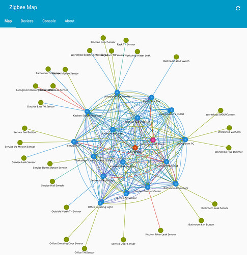

# Zigbee Map

Visualizing your Zigbee mesh network is essential for understanding device connectivity, diagnosing issues, and optimizing performance. This guide outlines how to use Zigbee Map tools within Home Assistant to generate interactive network graphs.

---

## Overview

Zigbee Map is a visualization tool that displays the topology of your Zigbee mesh network. It helps users:

- Identify weak signal paths
- Detect isolated or poorly connected devices
- Understand routing behavior
- Improve placement of repeaters and routers

---

## Supported Integrations

Zigbee Map works with the following Home Assistant integrations:

| Integration     | Description                                      | Requirements               |
|-----------------|--------------------------------------------------|----------------------------|
| ZHA             | Native Zigbee integration in Home Assistant      | No external dependencies   |
| Zigbee2MQTT     | MQTT-based Zigbee integration                    | MQTT broker + Zigbee2MQTT |

---

## Installation

### Manual Installation (Recommended)

1. Download the panel script: [zigbee-map-panel.js](https://codeberg.org/dan-danache/ha-zigbee-map/raw/branch/master/custom_components/zigbee_map/panel/dist/zigbee-map-panel.js)
2. Place it in the conf/www directory
3. Add the following snippet to your configuration.yaml file:

```yaml
 panel_custom:
   - name: zigbee-map-panel
     url_path: zigbee-map
     module_url: /local/zigbee-map-panel.js
     sidebar_title: Zigbee Map
     sidebar_icon: mdi:hub
```
4. Restart Home Assistant
5. The Zigbee Map panel should now appear in your sidebar

---

## Configuration

---

## Usage

Once configured, Zigbee Map will generate a dynamic graph showing:

- Nodes (devices)
- Edges (connections)
- Signal strength
- Routing paths

### Example Screenshot



---

## Troubleshooting

| Issue                        | Solution                                      |
|-----------------------------|-----------------------------------------------|
| Devices missing from map    | Ensure they are paired and online             |
| Map not loading             | Check browser console for errors              |
| Incorrect routing shown     | Restart Zigbee coordinator and refresh map    |

---

## Resources

- [Zigbee Map Community Thread](https://community.home-assistant.io/t/zigbee-map-visualize-your-mesh-network/921489)
- [Zigbee Map Releases](https://codeberg.org/dan-danache/ha-zigbee-map/releases)
- [ZHA Documentation](https://www.home-assistant.io/integrations/zha/)
- [Zigbee2MQTT Docs](https://www.zigbee2mqtt.io/)

---

## Best Practices

- Place routers strategically to improve mesh coverage
- Avoid physical obstructions between devices
- Regularly check the map for topology changes
- Use powered devices as repeaters when possible

---

## Contribution

Want to improve Zigbee Map?

1. Fork the repository
2. Submit pull requests
3. Join the discussion on the [community thread](https://community.home-assistant.io/t/zigbee-map-visualize-your-mesh-network/921489)

---

## Summary

Zigbee Map is a powerful tool for smart home enthusiasts using Zigbee devices. Whether you're troubleshooting connectivity or optimizing your mesh layout, this visualization tool offers valuable insights into your network.

Ready to map your mesh? Dive in and explore your Zigbee universe!

---

*Generated using AI*