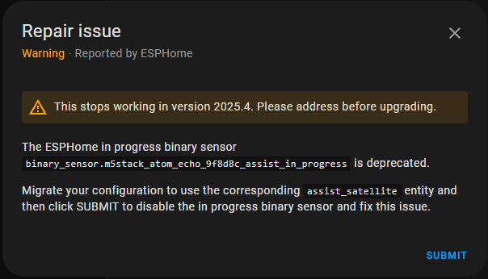

# Setup

## Setting Up Assist Local
Enable voice assistant functionality in Home Assistant with local processing for privacy and performance.

## Overview
This guide explains how to set up Assist Local in Home Assistant to use voice commands without relying on cloud services. It covers installation, configuration, and troubleshooting.

### Technical Details
Assist Local uses Whisper for speech recognition and Piper for text-to-speech. These tools run locally, ensuring privacy and reducing latency. You can also configure a custom media player for audio output.

### Infobox
- **Speech Recognition**: Whisper  
- **Text-to-Speech**: Piper  
- **Custom Output**: Media Player (optional)  
- **Use Case**: Local voice assistant for Home Assistant.

### Steps    
1. **Install Whisper**:
   - Whisper is used for speech recognition. If your device does not support AVX, you can host Whisper on another server in your network. See [Whisper on Server](whisper.md) for details.
   
2. **Install Piper**:
   - Piper handles text-to-speech functionality. Install it on your Home Assistant instance.
   
3. **Configure Media Player Output** (optional):
   - Add the following configuration to your YAML file to use a custom media player for audio output:
   
     ```yaml
     on_tts_end: # Added for Media Player Output
       - homeassistant.service:
           service: media_player.play_media
           data:
             entity_id: media_player.msi_b150m
             media_content_id: !lambda 'return x;'
             media_content_type: music
             announce: "true" # Last line manual adjustment for Media Player Output
     ```   
   - Ensure the Atom Echo's volume is turned off if using an external media player.
   
4. **Restart Home Assistant**:
   - Apply the changes by restarting Home Assistant.

### Commands
- **Restart Home Assistant**:
  
  ```bash
  ha core restart
  ```

- **Check Configuration**:
  
  ```bash
  ha core check
  ```

### Examples
- [$13 voice assistant for Home Assistant](https://www.home-assistant.io/voice_control/thirteen-usd-voice-remote/){:target="_blank"}
- [Home Assistant Pipeline](https://www.youtube.com/watch?v=mVAwd_0Fheg){:target="_blank"}

  

### Resources
- [Wyoming](https://www.home-assistant.io/integrations/wyoming/){:target="_blank"}
- [m5stack-atom-echo.yaml](https://github.com/esphome/wake-word-voice-assistants/blob/main/m5stack-atom-echo/m5stack-atom-echo.yaml){:target="_blank"}
- [Getting started - Local Assist](https://www.home-assistant.io/voice_control/voice_remote_local_assistant/){:target="_blank"}

### Troubleshooting
- **Issue**: Audio output is not working.  
  **Resolution**: Verify the media player configuration and ensure the Atom Echo's volume is turned off.
- **Issue**: Your CPU does not support AVX.  
  **Resolution**: Use a version of Whisper compiled without AVX or host Whisper on a compatible server.  

See also:  

- [Service exited with code 256 (by signal 4) on x86_64](https://github.com/home-assistant/addons/issues/3035){:target="_blank"}

!!! question
    Is Speech-to-Phrase a possibility to use instead of Whisper

- [Getting started - Local](https://www.home-assistant.io/voice_control/voice_remote_local_assistant/)

!!! danger
    

---

*Generated using AI*