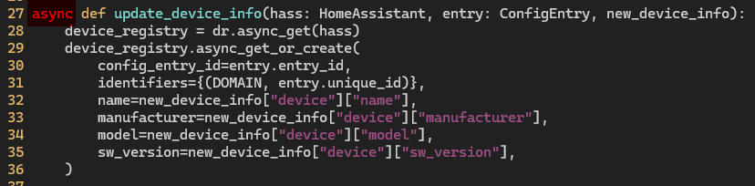
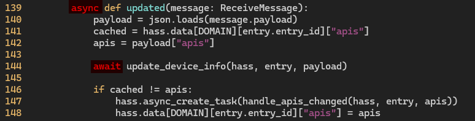

# HASS Agent

## HASS Agent Integration with Home Assistant
A clear and concise guide on installing and configuring HASS Agent.

## Overview
HASS Agent is a lightweight Windows-based tool designed for seamless integration with Home Assistant. This guide walks you through installing, configuring, and troubleshooting HASS Agent, ensuring smooth connectivity with your Home Assistant setup.

### Technical Details
HASS Agent provides essential features like MQTT-based device integration, Windows sensor monitoring, and automation capabilities with Home Assistant.

**Configuration Details**
```yaml
mqtt:
  host: "your_home_assistant_ip"
  port: 1883
  username: "mqtt_user"
  password: "mqtt_password"
```

### Infobox
- **Tool Name**: HASS Agent
- **Platform**: Windows
- **Integration Type**: MQTT, Commands, Sensors
- **Official Repository**: [HASS Agent GitHub](https://github.com/home-assistant/hass-agent)

### Steps
#### 1. Install HASS Agent
1. Download the latest version from the [HASS Agent Releases](https://github.com/home-assistant/hass-agent/releases).
2. Run the installer and follow the instructions.
3. Once installed, launch HASS Agent.

#### 2. Configure MQTT
1. Open HASS Agent and navigate to the MQTT configuration section.
2. Enter your Home Assistant IP, username, and password.
3. Save the settings and test the connection.

#### 3. Enable Windows Sensors
1. Go to the Sensors tab in HASS Agent.
2. Enable relevant sensors (e.g., CPU, RAM usage).
3. Save and sync with Home Assistant.

### Commands
Configure custom commands within HASS Agent to execute Windows-specific actions.
```yaml
commands:
  - name: "Shutdown PC"
    type: "shell"
    command: "shutdown /s /t 0"
```

### Examples
Here’s how to define an automation in Home Assistant to trigger HASS Agent commands.
```yaml
automation:
  alias: "Shutdown Windows PC"
  trigger:
    - platform: state
      entity_id: binary_sensor.shutdown_trigger
      to: "on"
  action:
    - service: mqtt.publish
      data:
        topic: "hass-agent/commands/shutdown_pc"
        payload: "execute"
```

### Resources
- [Home Assistant MQTT Documentation](https://www.home-assistant.io/docs/mqtt/)
- [HASS Agent Wiki](https://github.com/home-assistant/hass-agent/wiki)
- [Community Forum](https://community.home-assistant.io/)
- [HASS Agent Documentation](https://www.hass-agent.io/2.0/)
- [System Bridge](https://www.home-assistant.io/integrations/system_bridge/)
- [HASS Agent Setup](https://www.youtube.com/watch?v=B4SnJPVbSXc)
- [Control your Windows PC with Home Assistant](https://www.youtube.com/watch?v=Som-BO1sRvs&t=45s)

### Troubleshooting
#### Common Issues:
1. **MQTT Connection Fails**  
   * Ensure Home Assistant’s MQTT broker is running.  
   * Verify credentials and network connectivity.

2. **Sensors Not Updating**  
   * Check firewall settings to allow HASS Agent communication.  
   * Restart Home Assistant and HASS Agent.


!!! Bug
(Latest) HA Core update 2024.5.0 breaks notification/media player entities.

  Ok, so, Quick & Dirty fix for anyone that can/wants edit the files manually  

  Navigate to "/config/custom_components/hass_agent" - either inside the container or via some editor when using the supervisor enabled HA.  

  Edit "__init__.py" file (for example "vi __init__.py")  

  Add "async" in following places:  

  ```yaml
  line 27: "async def update_device_info(hass: HomeAssistant, entry: ConfigEntry, new_device_info):"
  line 139: "async def updated(message: ReceiveMessage):"
  ```

  Add "await" in following places:  

  ```yaml
  line 124: "await update_device_info(hass, entry, response_json)"
  line 144: "await update_device_info(hass, entry, payload)"
  ```

  
  

  Restart Home Assistant

  What I did was do the above changes on version lower than 2024.5.0, confirmed that notifications and media player are working, then I upgraded to 2024.5.0 and tested the same - appears to work as expected.

---

*Generated using AI*