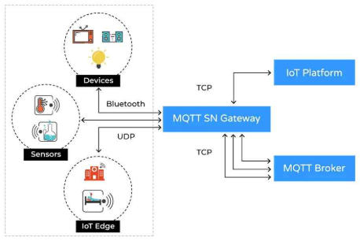

# MQTT

## Installation of MQTT in Home Assistant

## Overview
MQTT (Message Queuing Telemetry Transport) is a lightweight messaging protocol for small sensors and mobile devices. This guide provides a structured approach to installing and configuring MQTT within Home Assistant.

### Technical Details
MQTT enables smart home devices to communicate efficiently. Below is a diagram of a basic MQTT architecture:



#### System Requirements:
| Component              | Minimum Requirement                |
| ---------------------- | ---------------------------------- |
| Home Assistant Version | 2023.4 or later                    |
| MQTT Broker            | Mosquitto or any compatible broker |
| Network                | Stable local network connection    |

### Infobox
**Key Facts about MQTT**
- Lightweight protocol for IoT messaging.
- Works over TCP/IP networks.
- Supports QoS (Quality of Service) levels for reliability.

### Steps
1. **Install the MQTT Broker**
   - Go to Home Assistant UI and navigate to `Settings > Add-ons > Add-on Store`.
   - Search for **Mosquitto broker** and click `Install`.
   - After installation, enable `Start on boot` and `Watchdog`.

2. **Configure MQTT in Home Assistant**
   - Navigate to `Settings > Devices & Services > MQTT`.
   - Click `Configure` and enable **Discovery**.
   - Set up authentication details if required.

3. **Verify the Installation**
   - Use MQTT Explorer or MQTT CLI to test connectivity.
   - Publish a test message and check logs.

### Commands
To test the MQTT broker, use:

```sh
mosquitto_pub -h localhost -t "home/test" -m "Hello MQTT"
mosquitto_sub -h localhost -t "home/test"
```

### Examples
Example Home Assistant configuration for MQTT integration:

```yaml
mqtt:
  broker: localhost
  port: 1883
  username: "user"
  password: "password"
```

### Resources
- [Home Assistant MQTT Documentation](https://www.home-assistant.io/integrations/mqtt/)
- [Mosquitto MQTT Broker](https://mosquitto.org/)

### Troubleshooting
**Issue:** MQTT broker does not start.
**Resolution:** Check `mosquitto.conf` for errors and ensure the port is not blocked.

---

*Generated using AI*