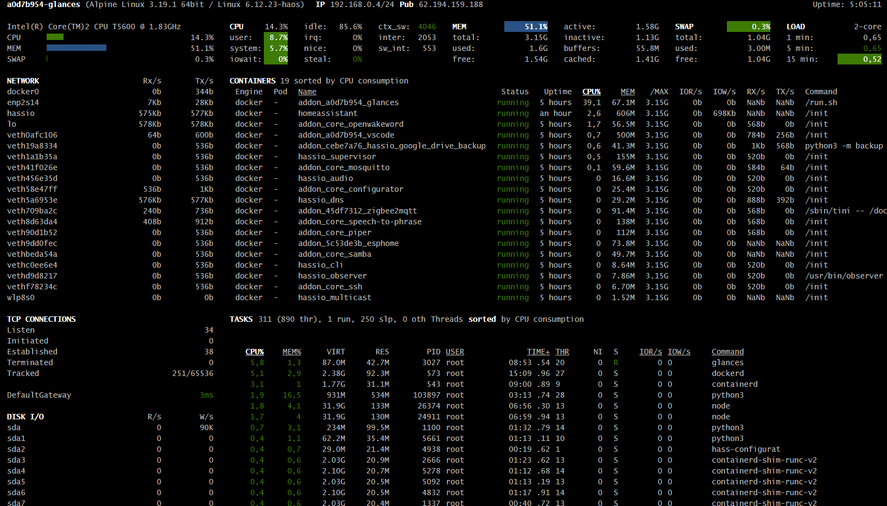

# Glances

## Installation and Usage of Glances Add-on / Integration within Home Assistant
   Learn how to set up and use the Glances add-on or integration in Home Assistant for real-time system monitoring.

## Overview
   Glances is a cross-platform system monitoring tool that provides detailed insights into system performance. When integrated with Home Assistant, it enables users to monitor CPU, memory, disk usage, and more directly from their smart home dashboard.

### Technical Details
   - **Requirements**:
     - Home Assistant Core 2023.4 or later
     - Glances 3.2 or later
   - **Features**:
     - Real-time system monitoring
     - Integration with Home Assistant dashboards
     - Customizable sensors for CPU, memory, disk, and network usage
   - **Outcome**: A fully integrated system monitoring solution within Home Assistant.

### Infobox
   **Key Facts**:
   - **Tool**: Glances
   - **Platform**: Home Assistant
   - **Features**: Real-time monitoring, customizable sensors, and dashboard integration.
   - **Extensions**: Support for MQTT and REST API for advanced configurations.



## Steps

### 1. Install Glances Add-on
   1. Open Home Assistant and navigate to **Settings > Add-ons**.
   2. Search for "Glances" in the add-on store.
   3. Click **Install** and wait for the installation to complete.
   4. Start the add-on and configure it as needed.

### 2. Configure Glances Integration
   1. Go to **Settings > Devices & Services** in Home Assistant.
   2. Click **Add Integration** and search for "Glances."
   3. Enter the IP address and port of the Glances server.
   4. Save the configuration and restart Home Assistant.

### 3. Add Glances Sensors to Dashboard
   1. Navigate to **Settings > Dashboards**.
   2. Add a new card and select the desired Glances sensors (e.g., CPU usage, memory usage).
   3. Customize the card layout and save the changes.

### 4. Test the Configuration
   1. Verify that the Glances sensors are updating in real-time on the dashboard.
   2. Check the Home Assistant logs for any errors or warnings.

## Examples
   - **Add Glances Sensor to Dashboard**:
     ```yaml
     type: entities
     entities:
       - entity: sensor.glances_cpu_usage
         name: CPU Usage
       - entity: sensor.glances_memory_usage
         name: Memory Usage
       - entity: sensor.glances_disk_usage
         name: Disk Usage
     ```
     {: .code-copy }

   - **Use MQTT for Advanced Configuration**:
     ```yaml
     mqtt:
       broker: mqtt.example.com
       port: 1883
       username: user
       password: pass
     ```
     {: .code-copy }

## Resources
   - [Glances Official Documentation](https://nicolargo.github.io/glances/)
   - [Home Assistant Documentation](https://www.home-assistant.io/)
   - [Glances MQTT Integration](https://nicolargo.github.io/glances/mqtt.html)

## Troubleshooting
   - **Issue**: Glances sensors not updating.
     **Resolution**: Verify the Glances server is running and accessible from Home Assistant.
   - **Issue**: Integration not found in Home Assistant.
     **Resolution**: Ensure the Glances add-on is installed and configured correctly.
   - **Issue**: Dashboard not displaying sensors.
     **Resolution**: Check the entity IDs and ensure they are added to the dashboard configuration.

---

*Generated using AI*     