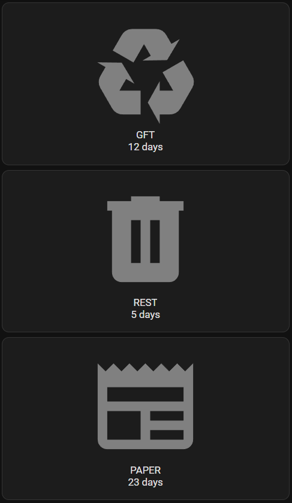

# Trash Sensor

## Creating a Custom Sensor for Trash Collection Days in Home Assistant
Guide on implementing a custom sensor to track trash collection days in Home Assistant.

## Overview
This guide provides instructions on setting up a custom sensor in Home Assistant to track trash collection days, improving automation and scheduling.

### Technical Details
Setting up a custom sensor involves YAML configuration and potentially a custom Python script. Home Assistant's template sensors can be used to extract and format waste collection schedules.

### Infobox
| Feature         | Description                                |
| --------------- | ------------------------------------------ |
| Platform        | Home Assistant                             |
| Sensor Type     | Template & Custom Integration              |
| Data Source     | Local municipality schedule, external APIs |
| Frequency       | Weekly or custom intervals                 |
| Use Cases       | Notification automation, dashboard display |

### Steps
1. **Identify Data Source:** Check municipality schedules or APIs for waste collection days.
2. **Create Template Sensor:** Use Home Assistant YAML to define a sensor based on schedule data.
3. **Automation Setup:** Configure alerts and notifications for trash collection reminders.
4. **Dashboard Display:** Implement Lovelace UI elements to show collection schedule.
5. **Testing & Validation:** Ensure correct functioning through debugging and HA logs.

### Commands
```yaml
- sensor:
    - name: "Trash Type This Week"
      unique_id: UUID
      state: >
        
        {% if week_number % 2 == 1 %}
          GFT
        
          Restafval
        
    - name: "Paper Bin Today"
      unique_id: UUID
      state: >
          {# change if needed #}
        
        
        {% if days_difference % 28 == 0 %}
          Paper
        
          No Paper
        
```

### Examples
```yaml
- sensor:
    - name: "Count Days to GFT Pick-up"
      unique_id: UUID
      state: >
          {# dinsdag = 1 #}
        
        
        {% set base_date = today + timedelta(days=((pickup_weekday - weekday_today) % 7)) %}
        
        {% if week_num % 2 == 1 %}
          
        
          
        
        {{ days_until }}
      unit_of_measurement: "days"
```

```yaml
alias: Notification - MobileApp - Trash
description: ""
triggers:
  - at: "07:00:00"
    trigger: time
conditions:
  - condition: time
    weekday:
      - mon
actions:
  - action: notify.mobile_app
    metadata: {}
    data:
      message: >
        Zet de {{ states('sensor.trash_type_this_week') }} container aan de
        straat!
mode: single
```

### Dashboard

```yaml
type: grid
cards:
  - type: custom:button-card
    entity: sensor.count_days_to_gft_pick_up
    name: GFT
    icon: mdi:recycle
    show_state: true
    color_type: icon
    state:
      - value: 0
        icon: mdi:trash-can
        color: red
        name: TODAY
      - value: 1
        icon: mdi:trash-can
        color: orange
        name: TOMORROW
      - operator: <
        value: 3
        color: green
        name: SOON
      - operator: default
        color: gray
  - type: custom:button-card
    entity: sensor.count_days_to_rest_pick_up
    name: REST
    icon: mdi:trash-can
    show_state: true
    color_type: icon
    state:
      - value: 0
        icon: mdi:trash-can
        color: red
        name: TODAY
      - value: 1
        icon: mdi:trash-can
        color: orange
        name: TOMORROW
      - operator: <
        value: 3
        color: green
        name: SOON
      - operator: default
        color: gray
  - type: custom:button-card
    entity: sensor.count_days_to_paper_pick_up
    name: PAPER
    icon: mdi:newspaper
    show_state: true
    color_type: icon
    state:
      - value: 0
        icon: mdi:trash-can
        color: red
        name: TODAY
      - value: 1
        icon: mdi:trash-can
        color: orange
        name: TOMORROW
      - operator: <
        value: 10
        color: green
        name: SOON
      - operator: default
        color: gray
```


The icons will change of color depending on the amount of days left to pick up.  
From gray to green, orange and red on the day itself.

### Resources
- [Home Assistant Documentation](https://www.home-assistant.io/)
- [Template Sensor Guide](https://www.home-assistant.io/integrations/template/)
- [Example Waste Collection APIs](https://example.com/apis)

### Troubleshooting
**Issue:** Sensor data not updating  
**Resolution:** Check YAML syntax, validate API responses, and verify Home Assistant logs.

**Issue:** Notifications not triggering  
**Resolution:** Ensure automations are correctly set up and review logs for errors.

---

*Generated using AI*