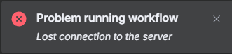

# Accessibility

## Making n8n accessible via IIS Reverse Proxy and SSL

## Overview
This document provides step-by-step instructions to make a local n8n installation accessible externally via IIS, acting as a reverse proxy with SSL configuration.

### Technical Details
IIS (Internet Information Services) can be configured as a reverse proxy to handle HTTPS connections for n8n, forwarding requests securely to a locally hosted instance.

### Infobox
| Component          | Description |
|-------------------|-------------|
| **IIS Version** | IIS 10 or later |
| **Reverse Proxy** | Application Request Routing (ARR) |
| **Security** | SSL Certificate required |
| **Local Server** | n8n running on localhost:5678 |

### Steps

#### 1. Install Required IIS Components
Ensure that **Application Request Routing (ARR)** and **URL Rewrite** modules are installed in IIS.

- Open **IIS Manager** (`inetmgr` via Run).
- Go to **Server Manager > Roles and Features** and check if **ARR** and **URL Rewrite** are installed.
- If missing, download **ARR** from [Microsoft IIS Extensions](https://www.iis.net/downloads).

#### 2. Configure Application Request Routing (ARR)
- Open **IIS Manager**.
- Click on the **server name** in the left panel.
- Go to **Application Request Routing Cache**.
- Click **Server Proxy Settings** in the right panel.
- Check **Enable Proxy** and click **Apply**.

#### 3. Create a New Site Binding for Your Subdomain
- Go to **Sites** and select your website (`n8n.domain.nl`).
- Click **Bindings...** (on the right panel).
- Add a new binding:
  - **Type:** HTTPS
  - **IP Address:** All unassigned
  - **Port:** 443
  - **SSL Certificate:** Select the correct certificate for `n8n.domain.nl`
- Click **OK**.

#### 4. Set Up a URL Rewrite Rule
- Select your site (`n8n.domain.nl`) and open **URL Rewrite**.
- Click **Add Rules...** and choose **Reverse Proxy**.
- Set the following configurations:
  - **Inbound URL:** `https://n8n.domain.nl`
  - **Rewrite to:** `http://localhost:5678`
  - **Allow SSL Offloading:** **On**
  - **Preserve Host Header:** **On**
- Click **Apply**.

#### 5. Test the Configuration
Visit `https://n8n.domain.nl` in your browser.
If configured correctly, IIS will forward HTTPS traffic to your **n8n instance at `http://localhost:5678`**.

### Commands
Below are useful IIS commands for debugging and testing the configuration:

```powershell
# Check IIS Site Bindings
Get-WebBinding

# Test Rewrite Rules
Get-WebConfigurationProperty -filter '/system.webServer/rewrite/rules' -name '.' -PSPath 'IIS:\'

# Verify ARR Proxy Settings
Get-WebConfigurationProperty -filter '/system.webServer/proxy' -name '.' -PSPath 'IIS:\'
```

### Examples
Example IIS configuration snippet for ARR proxy settings:

```xml
<?xml version="1.0" encoding="UTF-8"?>
<configuration>
  <system.webServer>


    <!-- Rewrite rules for proxying to n8n -->
    <rewrite>
      <rules>

        <!-- Proxy API requests (e.g., /rest/workflows) -->
        <rule name="Proxy API Calls to n8n" stopProcessing="true">
          <match url="^rest/(.*)$" />
          <conditions>
            <add input="{HTTP_HOST}" pattern="^n8n\.domein\.nl$" />
          </conditions>
          <action type="Rewrite" url="http://localhost:5678/rest/{R:1}" appendQueryString="true" />
        </rule>

        <!-- Proxy everything else (UI, WebSocket, static files) -->
        <rule name="Proxy All to n8n" stopProcessing="true">
          <match url="(.*)" />
          <conditions>
            <add input="{HTTP_HOST}" pattern="^n8n\.domein\.nl$" />
          </conditions>
          <action type="Rewrite" url="http://localhost:5678/{R:1}" appendQueryString="true" />
        </rule>

      </rules>
    </rewrite>

    <!-- CORS headers -->
    <httpProtocol>
      <customHeaders>
        <add name="Access-Control-Allow-Origin" value="https://n8n.ruyter.org" />
        <add name="Access-Control-Allow-Methods" value="GET, POST, OPTIONS" />
        <add name="Access-Control-Allow-Headers" value="Content-Type, Authorization" />
      </customHeaders>
    </httpProtocol>

  </system.webServer>
</configuration>


```

### Resources
- [Microsoft IIS ARR Documentation](https://docs.microsoft.com/en-us/iis/extensions/application-request-routing)
- [IIS URL Rewrite Guide](https://docs.microsoft.com/en-us/iis/extensions/url-rewrite-module/using-the-url-rewrite-module)
- [n8n Official Docs](https://docs.n8n.io)

### Troubleshooting
| Issue | Resolution |
|------------|-------------|
| **SSL Certificate Not Applied** | Verify certificate bindings in IIS. |
| **502 Bad Gateway Error** | Check ARR settings; ensure correct proxy rules. |
| **Rewrite Rule Not Working** | Test the rule using IIS Rewrite logs. |
| **Local n8n Unreachable** | Confirm n8n is running and accessible at `localhost:5678`. |



https://community.n8n.io/t/error-while-executing-workflow/28560

Ensure WebSocket Protocol is installed in Windows features.
- Go to "Add Roles and Features" > under Web Server (IIS) > Web Server > Application Development.
- Ensure WebSocket Protocol is checked.

---

*Generated using AI*