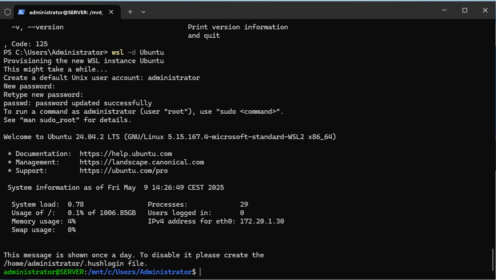

# Docker

## Installation of Docker for Windows Server 2025 and WSL with Ubuntu

## Overview
This guide covers the installation process for Docker on Windows Server 2025, including setting up Windows Subsystem for Linux (WSL) with Ubuntu.

### Technical Details
Docker provides containerization capabilities for running lightweight, portable applications. With Windows Server 2025, leveraging WSL allows a seamless integration of Linux distributions.

### Infobox
| Feature | Description |
|---------|------------|
| Docker Version | Latest stable release |
| OS Support | Windows Server 2025 |
| WSL Version | WSL 2 |
| Linux Distro | Ubuntu |

### Steps
#### Step 1: Clean-up
Remove all that we have installed and configured in the [first installation](installation.md).

#### Step 2: Add roles and features
Install Installeer Hyper-V and Containers

Ensure that the necessary features are enabled:
```
dism /online /enable-feature /featurename:Microsoft-Windows-Subsystem-Linux
dism /online /enable-feature /featurename:VirtualMachinePlatform
```

#### Step 3: Install Docker CE / Moby
Install Docker
```powershell
Invoke-WebRequest -UseBasicParsing "https://raw.githubusercontent.com/microsoft/Windows-Containers/Main/helpful_tools/Install-DockerCE/install-docker-ce.ps1" -o install-docker-ce.ps1
```

```powershell
powershell -ExecutionPolicy Bypass -File install-docker-ce.ps1
```

#### Step 4: Switch OS Type
Within Docker we now need to switch to Linux to be able to use Linux based packages.
Normally you should do that with dockercli.exe -switchdeamon

```powershell
& 'C:\Program Files\Docker\Docker\DockerCli.exe' -SwitchDaemon
```
The only problem is: I don't have that executable in my installation, so we need to do it the hard way.  
So let's continue.  

#### Step 5: Enable WSL and Virtual Machine Platform
Run the following command in PowerShell (Administrator):
Check for WSL 2 (back-end for linux contaciners)

```powershell
wsl --list --verbose
```

```powershell
wsl --install -d Ubuntu
```

This will install Ubuntu.  
We still need to change the OS Type to Linux.

```powershell
docker info | Select-String "OSType"
```

#### Step 6: Installl Docker in Ubuntu
As soon as you are in Ubuntu (WSL Terminal), you can install docker within Ubuntu.  
To do that use:

```wsl
sudo apt update && sudo apt install -y docker.io
```

```wsl
sudo systemctl enable --now docker
```

Check the installation:  

```
docker --version
```

Add your user to the docker group  

```
sudo usermod -aG docker $USER
```

```
exec sudo su - $USER
```

This will avoid having to use sudo all the time.  
Test Linux containers in WSL Start a simple container to see if everything works:

```
docker run --rm -it alpine sh
```

Now Docker CE can run Linux containers via WSL.



### Commands
| Command | Description |
|---------|------------|
| `wsl --install` | Installs WSL with the default Linux distribution. |
| `winget install -e --id Docker.DockerDesktop` | Installs Docker Desktop. |
| `docker run hello-world` | Tests the Docker installation. |

```powershell
docker version
```

```powershell
docker info
```

### Examples
Run a simple Docker container:
```
docker run -it ubuntu bash
```

### Resources
- [Docker Official Documentation](https://docs.docker.com/)
- [WSL Documentation](https://learn.microsoft.com/en-us/windows/wsl/)
- [Switching to Docker](https://www.server-world.info/en/note?os=Windows_Server_2025&p=docker&f=1)
- [Get started Prep Windows for containers](https://learn.microsoft.com/en-us/virtualization/windowscontainers/quick-start/set-up-environment)
- [Install Docker](https://learn.microsoft.com/en-us/virtualization/windowscontainers/manage-docker/configure-docker-daemon#install-docker)

### Troubleshooting
| Issue | Solution |
|-------|---------|
| Docker not starting | Ensure WSL 2 integration is enabled in Docker Desktop settings. |
| Permission denied | Run PowerShell as Administrator. |

---

*Generated using AI*