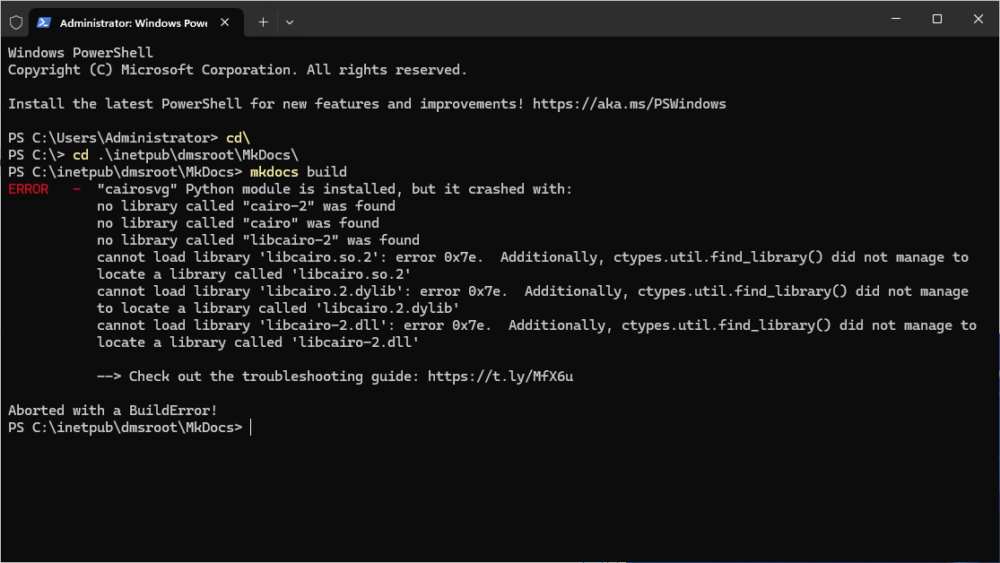

# Installation

## Installation of MkDocs Material with Python on Windows Server
   A step-by-step guide to setting up MkDocs Material.

## Overview
   MkDocs Material is a powerful and customizable theme for MkDocs, designed to create professional documentation sites. This guide walks you through the installation and configuration process on a Windows Server using Python.

### Technical Details
   - **Requirements**:
     - Python 3.7 or later
     - pip (Python's package manager)
     - Windows Server 2016 or later
   - **Dependencies**:
     - MkDocs
     - MkDocs Material theme
   - **Outcome**: A fully functional documentation site with Material design.

### Infobox
   **Key Facts**:
   - **Tool**: MkDocs Material
   - **Language**: Python
   - **Platform**: Windows Server
   - **Dependencies**: Python, pip, MkDocs

## Steps

### 1. Install Python
   1. Download Python from the [Official Python website](https://www.python.org/downloads/){:target="_blank"}.
   2. Run the installer and ensure the **"Add Python to PATH"** option is checked.
   3. Verify the installation:
      ```bash
      python --version
      ```
      {: .code-annotate }

### 2. Install MkDocs
   1. Open a terminal (Command Prompt or PowerShell).
   2. Install MkDocs using pip:
      ```bash
      pip install mkdocs
      ```
      {: .code-copy }
   3. Verify the installation:
      ```bash
      mkdocs --version
      ```
      {: .code-annotate }

### 3. Install MkDocs Material
   1. Install the Material theme:
      ```bash
      pip install mkdocs-material
      ```
      {: .code-copy }
   2. Verify the installation:
      ```bash
      mkdocs --version
      ```
      *Ensure the Material theme is listed in the output.*

### 4. Create a New MkDocs Project
   1. Navigate to your desired directory:
      ```bash
      cd path\to\your\directory
      ```
   2. Create a new MkDocs project:
      ```bash
      mkdocs new my-project
      ```
   3. Navigate into the project directory:
      ```bash
      cd my-project
      ```

### 5. Configure MkDocs Material
   1. Open the [mkdocs.yml] file in a text editor.
   2. Update the theme section:
      ```yaml
      theme:
        name: material
      ```
   3. Save the file.

### 6. Serve the Documentation Locally
   1. Run the following command:
      ```bash
      mkdocs serve
      ```
      {: .code-copy }
   2. Open your browser and go to `http://127.0.0.1:8000`.

## Examples
   - **Install MkDocs**:
     ```bash
     pip install mkdocs
     ```
   - **Install MkDocs Material**:
     ```bash
     pip install mkdocs-material
     ```
   - **Create a New Project**:
     ```bash
     mkdocs new my-project
     ```
   - **Serve Locally**:
     ```bash
     mkdocs serve
     ```

## Resources
   - [MkDocs Official Documentation](https://www.mkdocs.org/){:target="_blank"}
   - [MkDocs Material Documentation](https://squidfunk.github.io/mkdocs-material/){:target="_blank"}
   - [Python Downloads](https://www.python.org/downloads/){:target="_blank"}
   - [Python Markdown](https://python-markdown.github.io/){:target="_blank"}

## Troubleshooting
   - **Issue**: `mkdocs` command not found.
     **Resolution**: Ensure Python and pip are added to your system PATH.
   - **Issue**: Theme not applied.
     **Resolution**: Verify the `theme` section in [mkdocs.yml] is correctly configured.
   - **Issue**: Local server not accessible.
     **Resolution**: Check if the port `8000` is open and not blocked by a firewall.
   - **Issue**: ERROR   -  "cairosvg" Python module is installed, but it crashed.
     
     **Cause**: On Windows, Python packages like cairosvg need the Cairo DLLs to be installed separately. Here's how to fix it, you need to install Cairo for Windows.
     **Resolution**: Install MSYS2: Download and install from [MSYS2](https://www.msys2.org/){:target="_blank"}. Open the MSYS2 terminal (not cmd, not PowerShell). Run these commands inside MSYS2:

     ``` title="In MSYS2 Terminal" linenums="1"
     pacman -Sy
     ```

     ``` title="In MSYS2 Terminal" linenums="1"
     pacman -S mingw-w64-x86_64-cairo
     ```
     Add MSYS2's /mingw64/bin to your Windows PATH environment variable.
     
---

*Generated using AI*