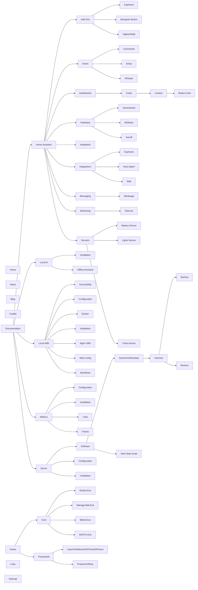

# Sitemap

```mermaid
graph LR
N1["Home"]
N2["About"]
N3["Blog"]
N4["Credits"]
N5["Documentation"]
N6["Home Assistant"]
N5 --> N6
N7["Add-Ons"]
N6 --> N7
N8["Esphome"]
N7 --> N8
N9["Mosquitto Broker"]
N7 --> N9
N10["Zigbee2Mqtt"]
N7 --> N10
N11["Assist"]
N6 --> N11
N12["Commands"]
N11 --> N12
N13["Setup"]
N11 --> N13
N14["Whisper"]
N11 --> N14
N15["Dashboards"]
N6 --> N15
N16["Cards"]
N15 --> N16
N17["Custom"]
N16 --> N17
N18["Button-Card"]
N17 --> N18
N19["Hardware"]
N6 --> N19
N20["Homewizard"]
N19 --> N20
N21["M5Stack"]
N19 --> N21
N22["Sonoff"]
N19 --> N22
N23["Installation"]
N6 --> N23
N24["Integrations"]
N6 --> N24
N25["Esphome"]
N24 --> N25
N26["Hass Agent"]
N24 --> N26
N27["Mqtt"]
N24 --> N27
N28["Messaging"]
N6 --> N28
N29["Whatsapp"]
N28 --> N29
N30["Monitoring"]
N6 --> N30
N31["Glances"]
N30 --> N31
N32["Sensors"]
N6 --> N32
N33["Battery-Sensor"]
N32 --> N33
N34["Lights-Sensor"]
N32 --> N34
N35["Trash-Sensor"]
N32 --> N35
N36["Local Ai"]
N5 --> N36
N37["Installation"]
N36 --> N37
N38["Offline Assistant"]
N36 --> N38
N39["Local N8N"]
N5 --> N39
N40["Accessibility"]
N39 --> N40
N41["Configuration"]
N39 --> N41
N42["Docker"]
N39 --> N42
N43["Installation"]
N39 --> N43
N44["Nginx N8N"]
N39 --> N44
N45["Web.Config"]
N39 --> N45
N46["Workflows"]
N39 --> N46
N47["Mkdocs"]
N5 --> N47
N48["Configuration"]
N47 --> N48
N49["Installation"]
N47 --> N49
N50["Links"]
N47 --> N50
N51["Theme"]
N47 --> N51
N52["Server"]
N5 --> N52
N53["Software"]
N52 --> N53
N54["Docker%20Desktop"]
N53 --> N54
N55["Volumes"]
N54 --> N55
N56["Backup"]
N55 --> N56
N57["Restore"]
N55 --> N57
N58["Start-Stop Script"]
N53 --> N58
N59["Configuration"]
N52 --> N59
N60["Installation"]
N52 --> N60
N61["Howto"]
N62["Cmd"]
N61 --> N62
N63["Docker.Exe"]
N62 --> N63
N64["Manage-Bde.Exe"]
N62 --> N64
N65["Mklink.Exe"]
N62 --> N65
N66["W32Tm.Exe"]
N62 --> N66
N67["Powershell"]
N61 --> N67
N68["Learn%20About%20This%20Picture"]
N67 --> N68
N69["Product%20Key"]
N67 --> N69
N70["Links"]
N71["Sitemap"]
click N1 "/"
click N2 "/about/"
click N3 "/blog/"
click N4 "/credits/"
click N5 "/documentation/"
click N6 "/documentation/Home_Assistant/"
click N7 "/documentation/Home_Assistant/add-ons/"
click N8 "/documentation/Home_Assistant/add-ons/esphome/"
click N9 "/documentation/Home_Assistant/add-ons/mosquitto_broker/"
click N10 "/documentation/Home_Assistant/add-ons/zigbee2mqtt/"
click N11 "/documentation/Home_Assistant/assist/"
click N12 "/documentation/Home_Assistant/assist/commands/"
click N13 "/documentation/Home_Assistant/assist/setup/"
click N14 "/documentation/Home_Assistant/assist/whisper/"
click N15 "/documentation/Home_Assistant/dashboards/"
click N16 "/documentation/Home_Assistant/dashboards/cards/"
click N17 "/documentation/Home_Assistant/dashboards/cards/custom/"
click N18 "/documentation/Home_Assistant/dashboards/cards/custom/button-card/"
click N19 "/documentation/Home_Assistant/hardware/"
click N20 "/documentation/Home_Assistant/hardware/homewizard/"
click N21 "/documentation/Home_Assistant/hardware/m5stack/"
click N22 "/documentation/Home_Assistant/hardware/sonoff/"
click N23 "/documentation/Home_Assistant/installation/"
click N24 "/documentation/Home_Assistant/integrations/"
click N25 "/documentation/Home_Assistant/integrations/esphome/"
click N26 "/documentation/Home_Assistant/integrations/hass_agent/"
click N27 "/documentation/Home_Assistant/integrations/mqtt/"
click N28 "/documentation/Home_Assistant/messaging/"
click N29 "/documentation/Home_Assistant/messaging/whatsapp/"
click N30 "/documentation/Home_Assistant/monitoring/"
click N31 "/documentation/Home_Assistant/monitoring/glances/"
click N32 "/documentation/Home_Assistant/sensors/"
click N33 "/documentation/Home_Assistant/sensors/battery-sensor/"
click N34 "/documentation/Home_Assistant/sensors/lights-sensor/"
click N35 "/documentation/Home_Assistant/sensors/trash-sensor/"
click N36 "/documentation/Local_AI/"
click N37 "/documentation/Local_AI/installation/"
click N38 "/documentation/Local_AI/offline_assistant/"
click N39 "/documentation/Local_n8n/"
click N40 "/documentation/Local_n8n/accessibility/"
click N41 "/documentation/Local_n8n/configuration/"
click N42 "/documentation/Local_n8n/docker/"
click N43 "/documentation/Local_n8n/installation/"
click N44 "/documentation/Local_n8n/nginx_n8n/"
click N45 "/documentation/Local_n8n/web.config/"
click N46 "/documentation/Local_n8n/workflows/"
click N47 "/documentation/MkDocs/"
click N48 "/documentation/MkDocs/configuration/"
click N49 "/documentation/MkDocs/installation/"
click N50 "/documentation/MkDocs/links/"
click N51 "/documentation/MkDocs/theme/"
click N52 "/documentation/Server/"
click N53 "/documentation/Server/Software/"
click N54 "/documentation/Server/Software/Docker%20Desktop/"
click N55 "/documentation/Server/Software/Docker%20Desktop/Volumes/"
click N56 "/documentation/Server/Software/Docker%20Desktop/Volumes/backup/"
click N57 "/documentation/Server/Software/Docker%20Desktop/Volumes/restore/"
click N58 "/documentation/Server/Software/start-stop_script/"
click N59 "/documentation/Server/configuration/"
click N60 "/documentation/Server/installation/"
click N61 "/howto/"
click N62 "/howto/cmd/"
click N63 "/howto/cmd/docker.exe/"
click N64 "/howto/cmd/manage-bde.exe/"
click N65 "/howto/cmd/mklink.exe/"
click N66 "/howto/cmd/w32tm.exe/"
click N67 "/howto/powershell/"
click N68 "/howto/powershell/learn%20about%20this%20picture/"
click N69 "/howto/powershell/product%20key/"
click N70 "/links/"
click N71 "/sitemap/"
```
