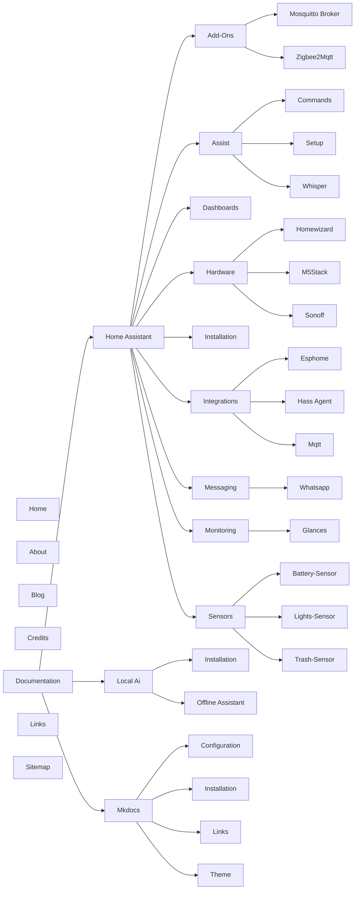

# Sitemap

```mermaid
graph LR
N1["Home"]
N2["About"]
N3["Blog"]
N4["Credits"]
N5["Documentation"]
N6["Home Assistant"]
N5 --> N6
N7["Add-Ons"]
N6 --> N7
N8["Mosquitto Broker"]
N7 --> N8
N9["Zigbee2Mqtt"]
N7 --> N9
N10["Assist"]
N6 --> N10
N11["Commands"]
N10 --> N11
N12["Setup"]
N10 --> N12
N13["Whisper"]
N10 --> N13
N14["Dashboards"]
N6 --> N14
N15["Hardware"]
N6 --> N15
N16["Homewizard"]
N15 --> N16
N17["M5Stack"]
N15 --> N17
N18["Sonoff"]
N15 --> N18
N19["Installation"]
N6 --> N19
N20["Integrations"]
N6 --> N20
N21["Esphome"]
N20 --> N21
N22["Hass Agent"]
N20 --> N22
N23["Mqtt"]
N20 --> N23
N24["Messaging"]
N6 --> N24
N25["Whatsapp"]
N24 --> N25
N26["Monitoring"]
N6 --> N26
N27["Glances"]
N26 --> N27
N28["Sensors"]
N6 --> N28
N29["Battery-Sensor"]
N28 --> N29
N30["Lights-Sensor"]
N28 --> N30
N31["Trash-Sensor"]
N28 --> N31
N32["Local Ai"]
N5 --> N32
N33["Installation"]
N32 --> N33
N34["Offline Assistant"]
N32 --> N34
N35["Mkdocs"]
N5 --> N35
N36["Configuration"]
N35 --> N36
N37["Installation"]
N35 --> N37
N38["Links"]
N35 --> N38
N39["Theme"]
N35 --> N39
N40["Links"]
N41["Sitemap"]
click N1 "/"
click N2 "/about/"
click N3 "/blog/"
click N4 "/credits/"
click N5 "/documentation/"
click N6 "/documentation/Home_Assistant/"
click N7 "/documentation/Home_Assistant/add-ons/"
click N8 "/documentation/Home_Assistant/add-ons/mosquitto_broker/"
click N9 "/documentation/Home_Assistant/add-ons/zigbee2mqtt/"
click N10 "/documentation/Home_Assistant/assist/"
click N11 "/documentation/Home_Assistant/assist/commands/"
click N12 "/documentation/Home_Assistant/assist/setup/"
click N13 "/documentation/Home_Assistant/assist/whisper/"
click N14 "/documentation/Home_Assistant/dashboards/"
click N15 "/documentation/Home_Assistant/hardware/"
click N16 "/documentation/Home_Assistant/hardware/homewizard/"
click N17 "/documentation/Home_Assistant/hardware/m5stack/"
click N18 "/documentation/Home_Assistant/hardware/sonoff/"
click N19 "/documentation/Home_Assistant/installation/"
click N20 "/documentation/Home_Assistant/integrations/"
click N21 "/documentation/Home_Assistant/integrations/esphome/"
click N22 "/documentation/Home_Assistant/integrations/hass_agent/"
click N23 "/documentation/Home_Assistant/integrations/mqtt/"
click N24 "/documentation/Home_Assistant/messaging/"
click N25 "/documentation/Home_Assistant/messaging/whatsapp/"
click N26 "/documentation/Home_Assistant/monitoring/"
click N27 "/documentation/Home_Assistant/monitoring/glances/"
click N28 "/documentation/Home_Assistant/sensors/"
click N29 "/documentation/Home_Assistant/sensors/battery-sensor/"
click N30 "/documentation/Home_Assistant/sensors/lights-sensor/"
click N31 "/documentation/Home_Assistant/sensors/trash-sensor/"
click N32 "/documentation/Local_AI/"
click N33 "/documentation/Local_AI/installation/"
click N34 "/documentation/Local_AI/offline_assistant/"
click N35 "/documentation/MkDocs/"
click N36 "/documentation/MkDocs/configuration/"
click N37 "/documentation/MkDocs/installation/"
click N38 "/documentation/MkDocs/links/"
click N39 "/documentation/MkDocs/theme/"
click N40 "/links/"
click N41 "/sitemap/"
```
