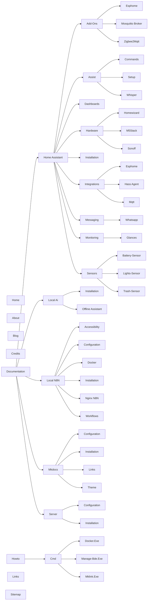

# Sitemap

```mermaid
graph LR
N1["Home"]
N2["About"]
N3["Blog"]
N4["Credits"]
N5["Documentation"]
N6["Home Assistant"]
N5 --> N6
N7["Add-Ons"]
N6 --> N7
N8["Esphome"]
N7 --> N8
N9["Mosquitto Broker"]
N7 --> N9
N10["Zigbee2Mqtt"]
N7 --> N10
N11["Assist"]
N6 --> N11
N12["Commands"]
N11 --> N12
N13["Setup"]
N11 --> N13
N14["Whisper"]
N11 --> N14
N15["Dashboards"]
N6 --> N15
N16["Hardware"]
N6 --> N16
N17["Homewizard"]
N16 --> N17
N18["M5Stack"]
N16 --> N18
N19["Sonoff"]
N16 --> N19
N20["Installation"]
N6 --> N20
N21["Integrations"]
N6 --> N21
N22["Esphome"]
N21 --> N22
N23["Hass Agent"]
N21 --> N23
N24["Mqtt"]
N21 --> N24
N25["Messaging"]
N6 --> N25
N26["Whatsapp"]
N25 --> N26
N27["Monitoring"]
N6 --> N27
N28["Glances"]
N27 --> N28
N29["Sensors"]
N6 --> N29
N30["Battery-Sensor"]
N29 --> N30
N31["Lights-Sensor"]
N29 --> N31
N32["Trash-Sensor"]
N29 --> N32
N33["Local Ai"]
N5 --> N33
N34["Installation"]
N33 --> N34
N35["Offline Assistant"]
N33 --> N35
N36["Local N8N"]
N5 --> N36
N37["Accessibility"]
N36 --> N37
N38["Configuration"]
N36 --> N38
N39["Docker"]
N36 --> N39
N40["Installation"]
N36 --> N40
N41["Nginx N8N"]
N36 --> N41
N42["Workflows"]
N36 --> N42
N43["Mkdocs"]
N5 --> N43
N44["Configuration"]
N43 --> N44
N45["Installation"]
N43 --> N45
N46["Links"]
N43 --> N46
N47["Theme"]
N43 --> N47
N48["Server"]
N5 --> N48
N49["Configuration"]
N48 --> N49
N50["Installation"]
N48 --> N50
N51["Howto"]
N52["Cmd"]
N51 --> N52
N53["Docker.Exe"]
N52 --> N53
N54["Manage-Bde.Exe"]
N52 --> N54
N55["Mklink.Exe"]
N52 --> N55
N56["Links"]
N57["Sitemap"]
click N1 "/"
click N2 "/about/"
click N3 "/blog/"
click N4 "/credits/"
click N5 "/documentation/"
click N6 "/documentation/Home_Assistant/"
click N7 "/documentation/Home_Assistant/add-ons/"
click N8 "/documentation/Home_Assistant/add-ons/esphome/"
click N9 "/documentation/Home_Assistant/add-ons/mosquitto_broker/"
click N10 "/documentation/Home_Assistant/add-ons/zigbee2mqtt/"
click N11 "/documentation/Home_Assistant/assist/"
click N12 "/documentation/Home_Assistant/assist/commands/"
click N13 "/documentation/Home_Assistant/assist/setup/"
click N14 "/documentation/Home_Assistant/assist/whisper/"
click N15 "/documentation/Home_Assistant/dashboards/"
click N16 "/documentation/Home_Assistant/hardware/"
click N17 "/documentation/Home_Assistant/hardware/homewizard/"
click N18 "/documentation/Home_Assistant/hardware/m5stack/"
click N19 "/documentation/Home_Assistant/hardware/sonoff/"
click N20 "/documentation/Home_Assistant/installation/"
click N21 "/documentation/Home_Assistant/integrations/"
click N22 "/documentation/Home_Assistant/integrations/esphome/"
click N23 "/documentation/Home_Assistant/integrations/hass_agent/"
click N24 "/documentation/Home_Assistant/integrations/mqtt/"
click N25 "/documentation/Home_Assistant/messaging/"
click N26 "/documentation/Home_Assistant/messaging/whatsapp/"
click N27 "/documentation/Home_Assistant/monitoring/"
click N28 "/documentation/Home_Assistant/monitoring/glances/"
click N29 "/documentation/Home_Assistant/sensors/"
click N30 "/documentation/Home_Assistant/sensors/battery-sensor/"
click N31 "/documentation/Home_Assistant/sensors/lights-sensor/"
click N32 "/documentation/Home_Assistant/sensors/trash-sensor/"
click N33 "/documentation/Local_AI/"
click N34 "/documentation/Local_AI/installation/"
click N35 "/documentation/Local_AI/offline_assistant/"
click N36 "/documentation/Local_n8n/"
click N37 "/documentation/Local_n8n/accessibility/"
click N38 "/documentation/Local_n8n/configuration/"
click N39 "/documentation/Local_n8n/docker/"
click N40 "/documentation/Local_n8n/installation/"
click N41 "/documentation/Local_n8n/nginx_n8n/"
click N42 "/documentation/Local_n8n/workflows/"
click N43 "/documentation/MkDocs/"
click N44 "/documentation/MkDocs/configuration/"
click N45 "/documentation/MkDocs/installation/"
click N46 "/documentation/MkDocs/links/"
click N47 "/documentation/MkDocs/theme/"
click N48 "/documentation/Server/"
click N49 "/documentation/Server/configuration/"
click N50 "/documentation/Server/installation/"
click N51 "/howto/"
click N52 "/howto/cmd/"
click N53 "/howto/cmd/docker.exe/"
click N54 "/howto/cmd/manage-bde.exe/"
click N55 "/howto/cmd/mklink.exe/"
click N56 "/links/"
click N57 "/sitemap/"
```
